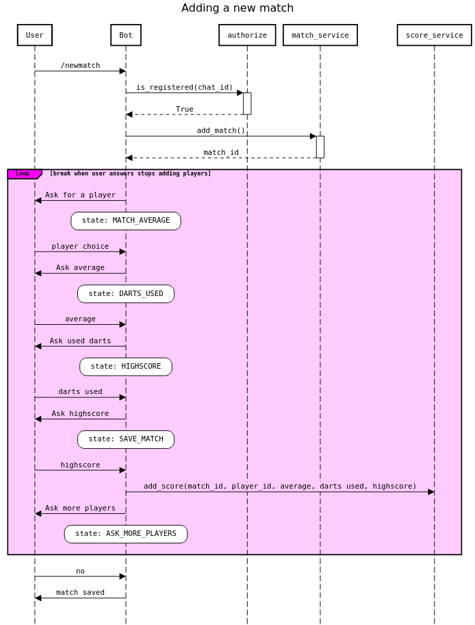

# Bot architecture

The bot is built on [python-telegram-bot](https://github.com/python-telegram-bot/python-telegram-bot) and uses its ConversationHandler class to hold longer conversations with users. The states of ConversationHandler are a bit complicated so this document tries to clear up how it works with sequence diagrams.

## Registration

### Successful registration

When the users sends the bot the command `/start`, the bot checks if the user is using a correct registration link. If yes, the bot asks the user for a name they want to set for themselves and goes to state `NAME`.

The users then sends their name and the bot calls the `create_user()` method of the UserService class to save the user to the database. The bot sends message to the user to let them know registration was successful and goes to state `END`. This tells the ConversationHandler that the current conversation has ended.

### Failed registration

If the user is not using the correct registration link, the bot goes to state `UNAUTHORIZED` and tells the user they are not authorized to register.

## Adding a new match

Adding a new match with the bot is a bit more complicated than registering. When the user gives the command `/newmatch`, the bot checks if the user is registered based on their telegram id. If yes, the bot creates a new match and remembers the match id.

Then the bot asks the user to add a player to the match. This is done with an inline keyboard so only registered users can be added to matches. The bot goes to state `MATCH_AVERAGE`. In this state, the bot will wait for an inline keyboard response from the sent keyboard. For this, CallbackQueryHandler is used.

The player then selects a player they want to add and the bot asks for their average in the match. The bot goes to state `DARTS_USED`. This might sound a bit confusing but used darts amount is asked next. In this state the bot waits for a message that is not in command format and passes that message to the `darts_used` function.

After the user sends in the players average, the bot now asks for the amount of darts they used and goes to state `HIGHSCORE`. The user sends in the amount of darts used and the bot asks for the players highscore. The bot goes to state `SAVE_MATCH`. Both of these states work similarly to the `DARTS_USED` state, listening to incoming messages that are not commands.

After the user has sent in the highscore, all given stats are saved for the player on the current match. To do this, the bot calls the `add_score()` method of the ScoreService class. After this, the bot asks the user if they want to add another player to the match and goes to state `ASK_MORE_PLAYERS`. In this state the bot checks the incoming message with regex.

The bot sends the user a custom keyboard where they can only answer yes or no so the regex matcher should always catch it and passes the message to the `more_players` function. If the answer is yes, the bot sends the user again the inline keyboard with available players and goes to state `MATCH_AVERAGE`.

When the user wants to stop adding players to the match and answers no, the bot goes tells the user the match has been saved and goes to state `END`.
